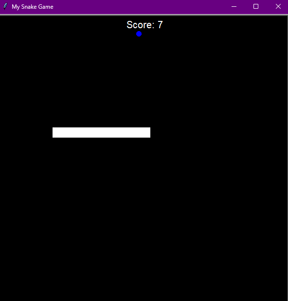
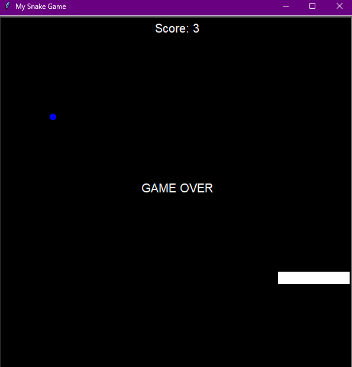

# Snake Game
# Overview
Hello, everyone! I'm Mert, and today marks Day 21 of my "100 Days of Python" challenge. For today's project, I'm thrilled to present the "Snake Game," a classic Python program using the Turtle graphics library. This project lets you control a snake on the screen, collecting food to grow longer while avoiding collisions with the walls and your own tail.

## Project Description
In the "Snake Game," you navigate a snake represented by a series of linked segments. Your goal is to eat the blue food items that appear on the screen to increase your snake's length. The game continues until the snake collides with the screen's boundaries or itself. The challenge lies in growing your snake as long as possible without running into obstacles.


## How to Run
To start the Snake Game, run the following command:

```bash
python main.py
```




Make sure you have Python installed on your system.

## Project Files
* main.py: The main Python script for the Snake Game.
* score_board.py: Creates a scoreboard and keeps score count.
* snake.py: Initialize the snake with starting positions.
* food.py: Initialize the food object.

## Getting Started
* Use the arrow keys (Up, Down, Left, Right) to control the snake's direction.
* Collect blue food items to increase the snake's length.
* Avoid hitting the walls or colliding with your own tail.
* Try to achieve the highest score possible before the game ends.
  
## Educational Insights
This project provides hands-on experience with key Python concepts:

* Turtle Graphics: Utilizing the Turtle graphics library for interactive visual elements.
* Object-Oriented Programming: Implementing classes (Snake, Food) to organize code and manage game entities.
* User Input Handling: Using keyboard input to control the snake's movement.
* Collision Detection: Checking for collisions with the walls, food, and the snake's own body.
* Game Logic: Implementing game mechanics such as scoring, growth, and game over conditions.


## Conclusion
I hope you enjoy playing the Snake Game! It's been an exciting journey reaching Day 21, and I'm eager to continue exploring and learning. Have fun navigating the snake, and happy coding!
